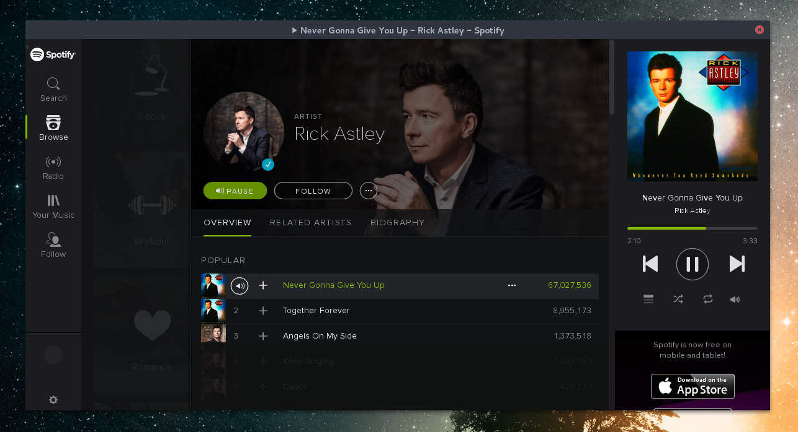

# Spotify for Linux

You want to hear Spotify on your Linux computer?    
You don't want to install Flashplayer?  

## Solution!

Spotify Web Player with nwjs and a packaged flash player  
so you don't have to install it &mdash; ~19MB + nwjs.

## Why?

Spotify doesn't develop the linux client anymore  
and I don't want to install flash player globally  
just to use the Spotify web client.  

## Any other reasons?

Yes. It blocks ad tracks  
so **you don't have to listen to ads**.  
Please support your favourite musicians!

## How to use it?

    # install nwjs: https://nwjs.io
    # clone this repo
    git clone https://github.com/samuelantonioli/spotify-for-linux.git && cd spotify-for-linux

    # start spotify
    $ ./start

    # have fun

Dependencies: Install/Use [nw.js >= 0.15](https://nwjs.io/)

## Alternatives

You don't like this and want more functionality?
No problem.  

[Spotify Web Player for Linux (uses Electron)](https://github.com/Quacky2200/Spotify-Web-Player-for-Linux)
